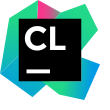
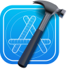

👋 Hi! I'm a teenager student with a deep passion for computer science and technology 💻🌐.

As an aspiring developer, I'm constantly on the lookout for new opportunities to learn and grow my skills 📈📚.

I have a strong desire to explore and experiment with different programming languages and technologies 🤖💻, and I love to tinker with new software and technologies in my free time 🕰️⚙️.

In addition to this, I'm also an avid participant in hackathons and coding challenges 🏆👨‍💻👩‍💻, as I believe that these experiences provide me with valuable opportunities to learn and grow as a developer.

On my GitHub profile 🐙, you can find a small collection of projects and experiments that I've worked on, and I'm excited to be a part of the open source community where I can learn from and collaborate with other developers 👨‍💻👩‍💻🤝.

<h3>🧰 Languages and Tools</h3>

	
	
	
	
	<!--  -->
	<!--  -->
	<!--  -->
	<!--  -->
	
	
	
	
	
	
	
	<!--  -->
	
	
	
	
	
	<!--  -->
	<!--  -->
	
	<!--  -->
	<!--  -->
	<!-- 	 -->
	
	<!--  -->
	
	<!--  -->
	<!--  -->
	
	
	

<!-- 

	

	<h3>🫠 About system</h3>
	

		<table>
			<tr>
				<th colspan="3"><b>Main Laptop</b>   <i>Lenovo g50-80</i></th>
			</tr>
			<tr>
				<td>OS</td>
				<td>Name</td>
				<td> Ubuntu 23.04 x86_64 </td>
			</tr>
			<tr>
				<td rowspan="3">CPU</td>
				<td>Name</td>
				<td>Intel Pentium N3540</td>
			</tr>
			<tr>
				<td>Core Count</td>
				<td>
4
</td>
			</tr>
			<tr>
				<td>Max Frequency</td>
				<td>
2.16 HZ
</td>
			</tr>
			<tr>
				<td rowspan="2">RAM</td>
				<td>Quantity</td>
				<td>
4GB
</td>
			</tr>
			<tr>
				<td>Max Frequency</td>
				<td>
13000 MZ
</td>
			</tr>
			<tr>
				<td>GPU</td>
				<td>Name</td>
				<td>
Intel Atom Processor   Z36xxx/Z37 <i><u>INTEGRATED</u></i>
</td>
			</tr>
		</table>
	

 -->

	

	<h3>About system</h3>
	

		<table>
			<tr>
				<td>
					<table>
						<tr>
							<th colspan="3"><b>Main Laptop</b>   <i>Macbook Air M2</i></th>
						</tr>
						<tr>
							<td>OS</td>
							<td>Name</td>
							<td>Dirwin OS</td>
						</tr>
						<tr>
							<td rowspan="3">CPU</td>
							<td>Name</td>
							<td>M2</td>
						</tr>
						<tr>
							<td>Core Count</td>
							<td>
8
</td>
						</tr>
						<tr>
							<td>Max Frequency</td>
							<td>
3.49 GHz
</td>
						</tr>
						<tr>
							<td rowspan="2">RAM</td>
							<td>Quantity</td>
							<td>
8GB
</td>
						</tr>
						<tr>
							<td>Max Frequency</td>
							<td>
6400 MZ
</td>
						</tr>
						<tr>
							<td>GPU</td>
							<td>Name</td>
							<td>
Apple M2 GPU
</td>
						</tr>
					</table>
				</td>
				<td>
					<table>
						<tr>
							<th colspan="3"><b>Primary Laptop</b>   <i>Lenovo g50-80</i></th>
						</tr>
						<tr>
							<td>OS</td>
							<td>Name</td>
							<td>Debian 12 x86_64 </td>
						</tr>
						<tr>
							<td rowspan="3">CPU</td>
							<td>Name</td>
							<td>Intel Pentium N3540</td>
						</tr>
						<tr>
							<td>Core Count</td>
							<td>
4
</td>
						</tr>
						<tr>
							<td>Max Frequency</td>
							<td>
2.16 GHz
</td>
						</tr>
						<tr>
							<td rowspan="2">RAM</td>
							<td>Quantity</td>
							<td>
4GB
</td>
						</tr>
						<tr>
							<td>Max Frequency</td>
							<td>
1300 MZ
</td>
						</tr>
						<tr>
							<td>GPU</td>
							<td>Name</td>
							<td>
Intel Atom Processor Z36xxx/Z37
</td>
						</tr>
					</table>
				</td>
			</tr>
		</table>	
	
	

